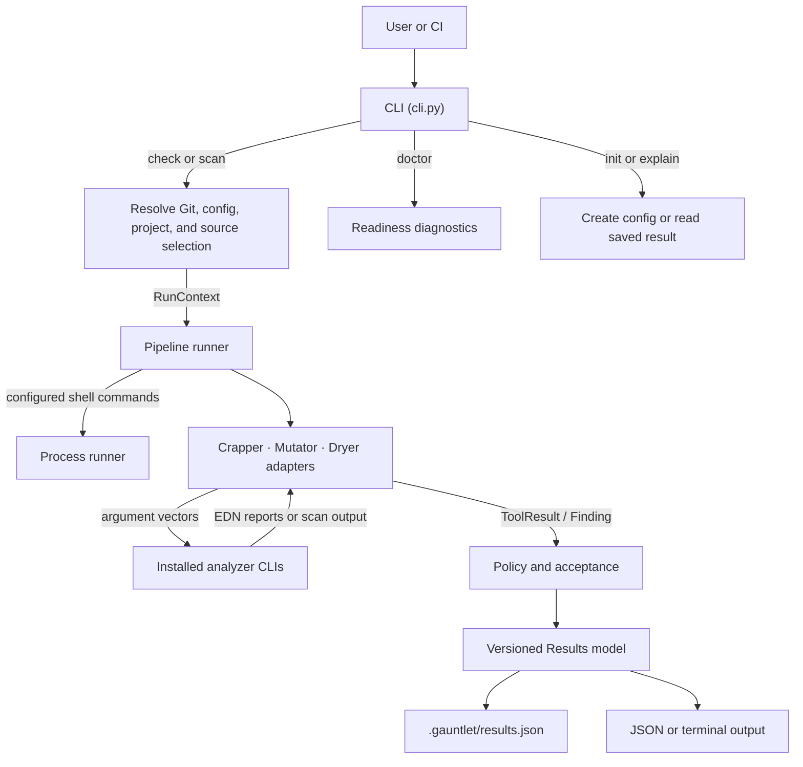
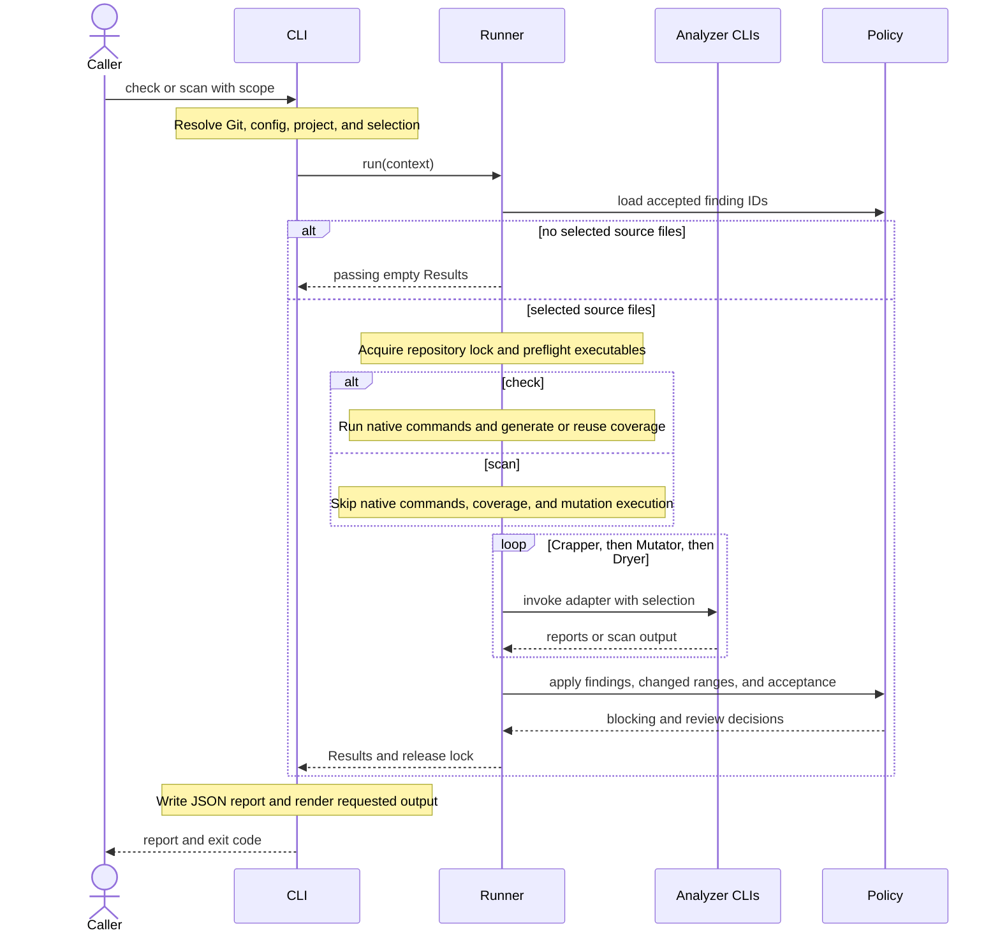
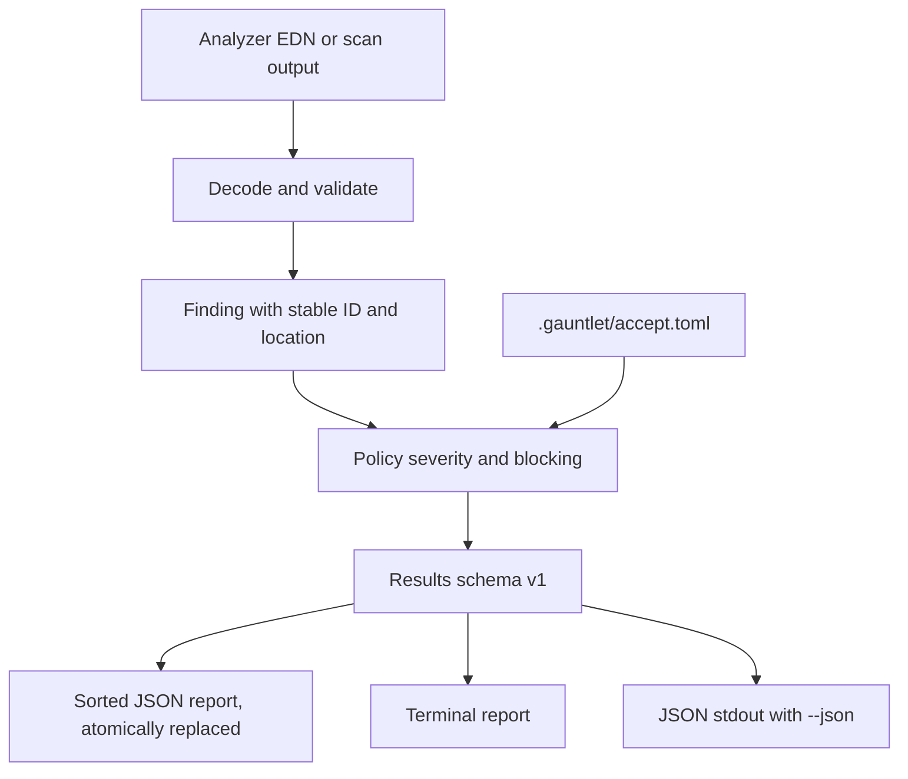

# Gauntlet Architecture

Gauntlet coordinates local repository checks and normalizes their results. It owns configuration, source selection, command execution, policy, and reporting. Crapper, Mutator, and Dryer own complexity, mutation, and similarity analysis. Checks do not install analyzers, modify project source, or upload reports. A separate explicit setup script/action installs compatible tools before checks. Configured project commands and external analyzers execute code; review them and run them only in an authorized runtime.

## Components and boundaries

- **CLI:** [`cli.py`](../src/gauntlet/cli.py) parses commands and prepares a [`RunContext`](../src/gauntlet/models.py). With no command, it runs `check`.
- **Configuration and selection:** [`config.py`](../src/gauntlet/config.py), [`discovery.py`](../src/gauntlet/discovery.py), [`git.py`](../src/gauntlet/git.py), and [`scope.py`](../src/gauntlet/scope.py) load version 1 configuration, detect project commands, and preflight known language capabilities before source selection.
- **Pipeline:** [`pipeline/runner.py`](../src/gauntlet/pipeline/runner.py) serializes runs, runs prerequisites, invokes adapters, and applies policy.
- **Adapters:** [`adapters/`](../src/gauntlet/adapters/) resolve installed tool executables and translate their output into shared findings.
- **Reporting:** [`models.py`](../src/gauntlet/models.py) defines locations, findings, and results. [`reporters/`](../src/gauntlet/reporters/) renders JSON and terminal output.

## Command and selection flow

`check` and `scan` first resolve the Git root, load `gauntlet.toml` when present, detect the project, and build the source selection. Without an explicit mode, both commands use configured mode, which defaults to `changed`; supplying paths without a mode selects `all`. Changed mode considers staged, unstaged, and untracked files. Deleted files are ignored. Supported-language, test, build, dependency, include, exclude, and explicit path filters are applied before analyzers run.

Project detection can supply test and coverage commands. Explicit commands from `gauntlet.toml` override detected commands. Enabled analyzers are resolved before project commands run. A missing executable therefore fails preflight instead of starting a partial check. An empty source selection returns before preflight, locking, native commands, or analyzers; it does not establish product correctness.

`--base REF` selects committed changes from the unique merge base with checked-out
HEAD. Git validates a clean tracked working tree and resolves immutable base/head
SHAs. The context carries the merge base to the policy runner so function spans
are compared with committed changed lines, not an empty working-tree diff. The
report records all three SHAs. This mode uses explicit analyzer paths rather than
their native working-tree `--changed` flag.

`scripts/setup-tools.sh` and `action.yml` are explicit network-enabled setup
surfaces. The script installs this checkout and dependencies pinned in `requirements-tools.txt` into one virtual environment and prefetches parser grammars. The action invokes the script, sets up Python, and adds the environment to PATH. The CLI never invokes setup. Cloud
agents run setup in their own runtime, independently of their dispatcher.

`scan` still requires the enabled analyzer executables. Crapper runs without coverage, Mutator lists possible mutation sites without running tests or mutants, and Dryer checks duplication. A full `check` runs configured prerequisite commands in the order shown above. If Crapper or Mutator is enabled, coverage must exist for selected languages; an existing supported report can be reused when no coverage command is configured.

## Findings and results

Adapters validate tool output and produce `Finding` values with a stable ID, tool, rule, severity, location, message, metadata, and blocking/accepted flags. The ID is a short SHA-256 digest of the finding identity. Mutator byte offsets are checked against the current source bytes before Gauntlet creates a location. Source paths from reports are resolved under the repository root; references outside it are rejected.

[`pipeline/policy.py`](../src/gauntlet/pipeline/policy.py) applies the configured CRAP threshold, blocking rules, and `.gauntlet/accept.toml`. Accepted findings remain visible in output and retain their reason, but do not block. A blocking finding sets the result to failed with exit code 3. Tool or configuration errors use their own stable exit codes.

Results are sorted deterministically and include summary counts. IDs and finding order are stable. Additive stage durations and cache/budget metadata vary between runs; entire JSON reports are not byte-stable. The JSON file is written to the configured output path (default `.gauntlet/results.json`) even when terminal output is selected. `--json` sends the same structured result to standard output; diagnostics stay separate.

CRAP policy combines Crapper's per-file provenance with Mutator function spans
when available. Those spans are intersected with working-tree or committed changed
lines; without spans, policy falls back to membership in changed files. Full-scan
selection does not make unchanged CRAP findings block, and there is no historical
CRAP baseline. Mutation analyzes selected files, not just the changed line ranges.
Dryer compares selected sources with each other; unchanged files outside that
selection are not a comparison corpus.

Git provenance is additive repository metadata in schema version 1: `--base` runs
include resolved `base_sha`, `head_sha`, and `merge_base_sha`. Failures during CLI
preparation may produce stdout JSON without writing the saved report. Consumers
must use the exit code and clear stale evidence before running checks.

## Runtime state and extension points

- `.gauntlet/mutation-cache/` stores complete content-keyed raw mutation evidence. Cache misses force `--mutate-all`; test edits cannot inherit old killed outcomes. The adapter budgets scan/line-group execution and reports truncation as nonzero partial results.
- `.gauntlet/run.lock` prevents overlapping runs in one repository. A stale lock is reported for manual inspection; Gauntlet does not remove it automatically.
- `.gauntlet/accept.toml` stores finding IDs, required reasons, and optional UTC expiry dates. `.gauntlet/results.json` stores the latest normalized result.
- `.metrics/` contains analyzer-owned reports. Coverage remains in the project’s supported report format; Gauntlet checks applicable artifact presence, and optionally reads coverage.py contexts for test attribution only.
- [`process.py`](../src/gauntlet/process.py) owns subprocess timeouts and termination. Analyzer CLIs receive argument vectors. Project commands from `gauntlet.toml` are trusted shell commands executed from the repository root.

To add an analyzer, implement the adapter contract in [`adapters/base.py`](../src/gauntlet/adapters/base.py), normalize its output into shared findings, register it in the runner and configuration, and cover its output contract with adapter tests. Keep source analysis in the upstream tool and policy decisions in the pipeline.

## Validation contracts

Unit and CLI integration tests exercise configuration, selection, adapters,
policy, error codes, stable finding identities, stage timings, acceptance hygiene, path policy, cache invalidation, and partial results. `tests/unit/test_setup.py` checks
installer invocation and failure propagation with a controlled interpreter.
`tests/integration/smoke_setup.sh` exercises the installed CLI and real pinned
analyzers: an empty committed selection, a surviving boundary mutant, then a
passing boundary repair. CI runs unit/integration tests, Ruff, package builds,
and a separate fresh-environment setup/smoke job through the root action. That job also exercises native cache/test-change correctness, budgets, and the paired evaluation harness with explicitly scripted controls.

## Hardening and evaluation boundaries

`support.py` records capabilities of reviewed analyzer pins; recognized unsupported
code fails before commands, rather than disappearing into an empty selection.
`pipeline/triage.py` adds optional actual coverage.py line contexts and advisory
co-change/assertion signals. These signals do not establish equivalence or test
quality. `pipeline/acceptance.py` validates reasons/expiry and adds review findings
for expired and unobserved IDs. `pipeline/crap.py` applies first-match path rules
and formula-based levers; it does not estimate actual refactoring cost.

`adapters/mutation_run.py` owns upstream inventory and line-batch scheduling;
`pipeline/cache.py` fingerprints inputs without analyzing source behavior. A
complete cache hit is re-normalized and current policy reapplied. Analyzer source
analysis and mutation execution remain external CLI boundaries. A timed-out stage
terminates its process group and returns incomplete evidence with a nonzero exit.

The repository-only `benchmarks/` harness runs supplied trusted commands in fresh
Git fixtures, then evaluates held-out behavior separately from gate results. It
has no model calls, uploads, or package-level dependency on an agent SDK. Its
scripted controls demonstrate failure modes, not improved AI-agent development.
