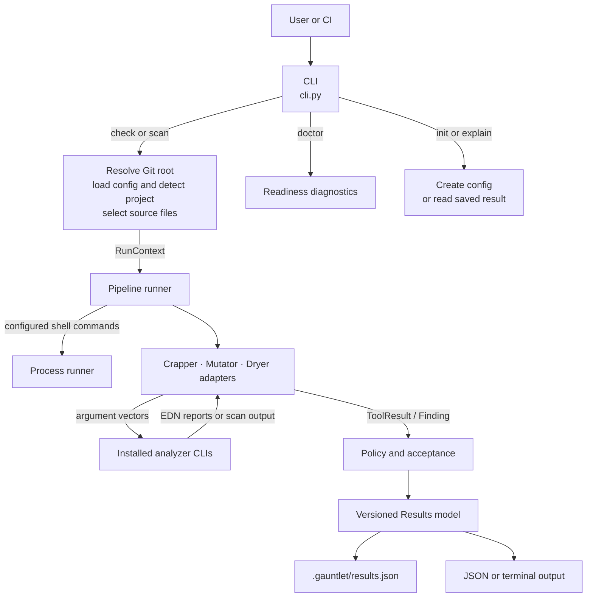
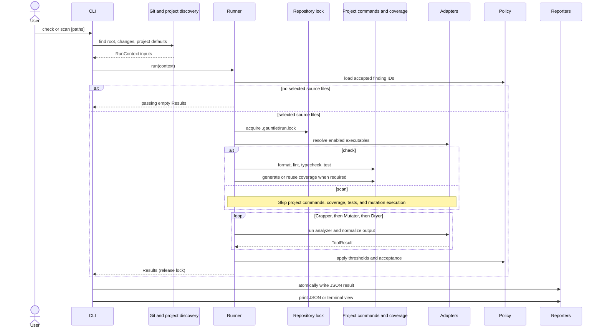
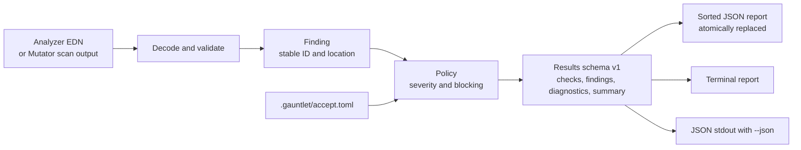

# Gauntlet Architecture

Gauntlet coordinates local repository checks and normalizes their results. It owns configuration, source selection, command execution, policy, and reporting. Crapper, Mutator, and Dryer own complexity, mutation, and similarity analysis. Gauntlet does not implement those analyzers, install them, modify project source, or upload reports.

## Components and boundaries

- **CLI:** [`cli.py`](../src/gauntlet/cli.py) parses commands and prepares a [`RunContext`](../src/gauntlet/models.py). With no command, it runs `check`.
- **Configuration and selection:** [`config.py`](../src/gauntlet/config.py), [`discovery.py`](../src/gauntlet/discovery.py), [`git.py`](../src/gauntlet/git.py), and [`scope.py`](../src/gauntlet/scope.py) load version 1 configuration, detect project commands, and choose supported source files.
- **Pipeline:** [`pipeline/runner.py`](../src/gauntlet/pipeline/runner.py) serializes runs, runs prerequisites, invokes adapters, and applies policy.
- **Adapters:** [`adapters/`](../src/gauntlet/adapters/) resolve installed tool executables and translate their output into shared findings.
- **Reporting:** [`models.py`](../src/gauntlet/models.py) defines locations, findings, and results. [`reporters/`](../src/gauntlet/reporters/) renders JSON and terminal output.

## Command and selection flow

`check` and `scan` first resolve the Git root, load `gauntlet.toml` when present, detect the project, and build the source selection. Without an explicit mode, both commands use configured mode, which defaults to `changed`; supplying paths without a mode selects `all`. Changed mode considers staged, unstaged, and untracked files. Deleted files are ignored. Supported-language, test, build, dependency, include, exclude, and explicit path filters are applied before analyzers run.

Project detection can supply test and coverage commands. Explicit commands from `gauntlet.toml` override detected commands. Enabled analyzers are resolved before project commands run. A missing executable therefore fails preflight instead of starting a partial check.

`scan` still requires the enabled analyzer executables. Crapper runs without coverage, Mutator lists possible mutation sites without running tests or mutants, and Dryer checks duplication. A full `check` runs configured prerequisite commands in the order shown above. If Crapper or Mutator is enabled, coverage must exist for selected languages; an existing supported report can be reused when no coverage command is configured.

## Findings and results

Adapters validate tool output and produce `Finding` values with a stable ID, tool, rule, severity, location, message, metadata, and blocking/accepted flags. The ID is a short SHA-256 digest of the finding identity. Mutator byte offsets are checked against the current source bytes before Gauntlet creates a location. Source paths from reports are resolved under the repository root; references outside it are rejected.

[`pipeline/policy.py`](../src/gauntlet/pipeline/policy.py) applies the configured CRAP threshold, blocking rules, and `.gauntlet/accept.toml`. Accepted findings remain visible in output and retain their reason, but do not block. A blocking finding sets the result to failed with exit code 3. Tool or configuration errors use their own stable exit codes.

Results are sorted deterministically and include summary counts. They omit timestamps and durations so equivalent inputs produce stable JSON. The JSON file is written to the configured output path (default `.gauntlet/results.json`) even when terminal output is selected. `--json` sends the same structured result to standard output; diagnostics stay separate.

## Runtime state and extension points

- `.gauntlet/run.lock` prevents overlapping runs in one repository. A stale lock is reported for manual inspection; Gauntlet does not remove it automatically.
- `.gauntlet/accept.toml` stores finding IDs and reasons. `.gauntlet/results.json` stores the latest normalized result.
- `.metrics/` contains analyzer-owned reports. Coverage remains in the project’s supported report format; Gauntlet checks that it exists but does not parse it.
- [`process.py`](../src/gauntlet/process.py) owns subprocess timeouts and termination. Analyzer CLIs receive argument vectors. Project commands from `gauntlet.toml` are trusted shell commands executed from the repository root.

To add an analyzer, implement the adapter contract in [`adapters/base.py`](../src/gauntlet/adapters/base.py), normalize its output into shared findings, register it in the runner and configuration, and cover its output contract with adapter tests. Keep source analysis in the upstream tool and policy decisions in the pipeline.
